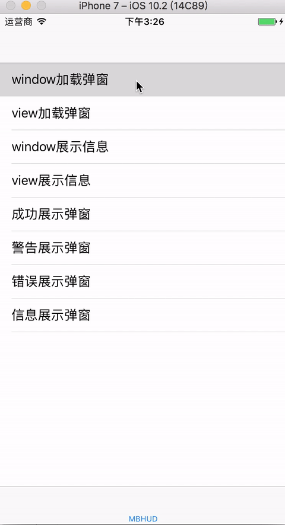

# MBProgressHUD-JDragon
MBProgressHUD  封装

![badge-pod] ![badge-languages] ![badge-platforms] ![badge-mit]


# 使用效果


### user pod

```

pod 'MBProgressHUD+JDragon'


```

##基本使用

```


[MBProgressHUD showActivityMessageInWindow:nil];

[MBProgressHUD showActivityMessageInView:nil];

[MBProgressHUD showTipMessageInWindow:@"在window"];

[MBProgressHUD showTipMessageInView:@"在View"];

[MBProgressHUD showSuccessMessage:@"加载成功"];

[MBProgressHUD showWarnMessage:@"显示警告"];

[MBProgressHUD showErrorMessage:@"显示错误"];

[MBProgressHUD showInfoMessage:@"显示信息"];


```


##详细请看demo


[badge-platforms]: https://img.shields.io/badge/platforms-iOS-lightgrey.svg
[badge-pod]: https://img.shields.io/cocoapods/v/JDragonHUD.svg?label=version
[badge-languages]: https://img.shields.io/badge/languages-ObjC-orange.svg
[badge-mit]: https://img.shields.io/badge/license-MIT-blue.svg
